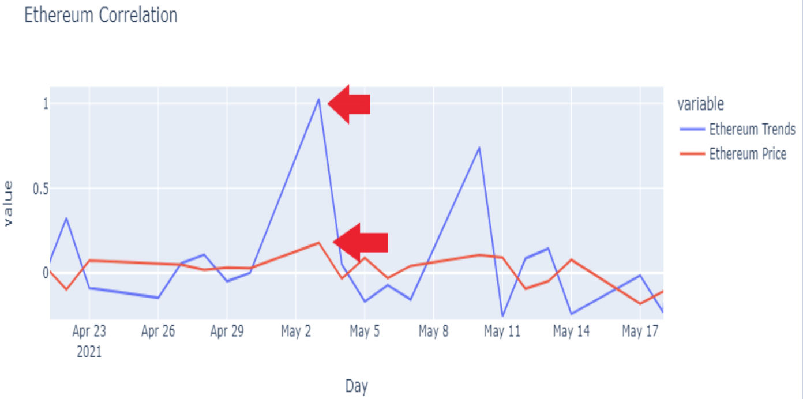
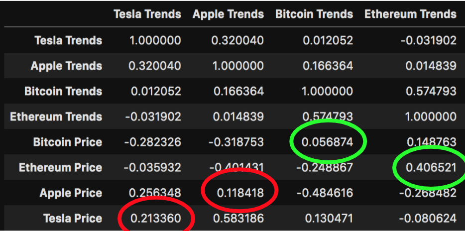
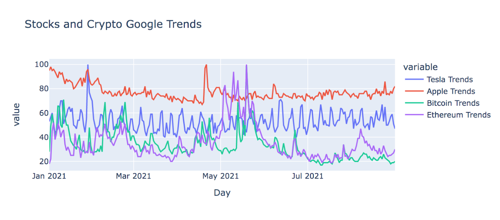
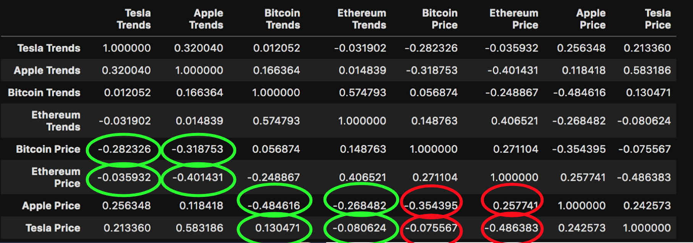

# Findings Summary

## Is there a correlation between Google search activity and asset prices?

Yes, there was a positive correlation between Google search activity and asset prices. After creating a correlation matrix, we found that Apple's stock price and its Google Trends score had a correlation of 0.12; Tesla's stock price and its Google Trends score had a correlation of 0.21; Bitcoin's price and its Google Trends score had a correlation of 0.06, and Apple's stock price and its Google Trends score had a correlation of 0.41. Thus, with an average correlation of 0.2, asset prices and Google search activity had a positive correlation.

## If there is a correlation, is it typically predictive or reactive?

We were not able to answer this question with certainty because of the frequency of our data. Because we used daily data and information can be spread in seconds over the internet, it was challenging for us to accurately determine whether or not the correlation was predictive or reactive. However, we noticed that Google search activity commonly increased and decreased at faster rates than prices, potentially suggesting that Google Trends were predictive of price changes.

## Is the correlation between Google searches stronger with stocks or crypto?

The correlation between Google searches was stronger with crypto, although by a small margin. The average crypto to Trends correlation was 0.24, while the average stock to Trends correlation was 0.17. It is also worth noting that Ethereum had, by far, the strongest correlation to Google search activity at 0.41, further supporting that crypto was more strongly correlated to Google Trends than stocks.

## Is there a latency between Google search activity and price movement?

Like our question about predictive or reactive correlation, we were not able to answer this question with certainty because of the frequency of our data. With that being said and by analyzing our graphs of each asset's price versus its Google Trends score, it was clear that prices and Google search activity changed on the same day, illustrating that any latency between an asset's price movement and Google search activity was less than a day.

## What else did we learn?
After analyzing our data, we identified Apple as the most consistently searched asset with an average Google Trends score of about 80. With Tesla's average score hovering closer to 60 and both Bitcoin and Ethereum's scores fluctuating heavily, we also determined stocks were searched more consistently than crypto. Looking at our correlation matrix further, we discovered stock and crypto prices had a generally negative correlation with an average correlation of -0.17. Finally, we noticed stock prices and crypto Trends had a negative correlation, as did crypto prices and stock Trends.

